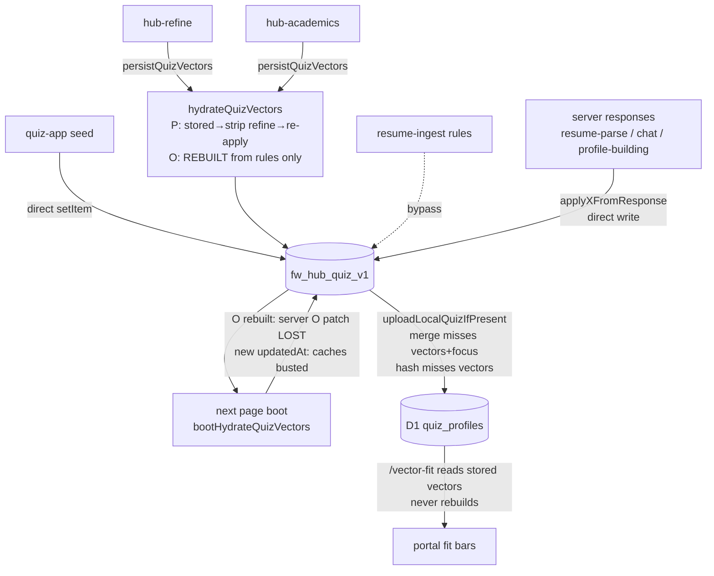
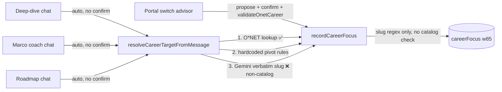

# FlightWay — Phase 0 Audit Report

**Branch:** `Jacob_Work` @ `980b1dd` · **Date:** 2026-07-02
**Scope:** Research only — no code changes made. Companion to `docs/POLISH_AND_INTEGRATION_PLAN.md`.

> **Phase 1 status (updated 2026-07-02):** issues **1, 2, 4, 5, 6, 7, 8, 9** fixed and issue **3** fixed across commits `8ae731c` (sync integrity + idempotent hydration; also fixed two bugs found while testing: destructive refine strip zeroing seeded personality, and resume bleed accumulating +0.2×delta per page load), `4590342` (catalog-validated pivots; also fixed roadmap-chat pivots not recording focus and reusing the old career's fitContext), `b31173b` (persisted objective AI patch layer + coach/deep-dive chat objective patches — closes the handoff TODO), `ae95736` (blended fitForSlugOrSoc, legacy deep-dive fit fallback removed), `e6840dd` (bypass writes routed through persistQuizVectors; quiz-app initial seed intentionally left). Issue 16 downgraded: the legacy hub fit panel is the O*NET-load-failure fallback and already hidden whenever dual-fit has data — deletion deferred. Issues 10–15, 17–21 remain for Phases 2–4.
>
> **Phase 2 status (updated 2026-07-03):** issues **10, 12, 13, 14, 15** fixed (`34c3409`, `c184a3e`, `b2c2aee`, `35ec995`); issue **11** closed as keep-with-documentation (the 12 curated app-pages entries are the richest pre-AI shell; quiz no longer routes into them). Two more live bugs found: quiz results buttons were dead (ReferenceError) and background keyword enrichment never ran. New guards: `npm run test:vectors`, `npm run verify:aliases`. Issues 17–21 remain for Phases 3–4.
>
> **Phase 3 status (updated 2026-07-03):** issue **17** fixed (Playfair retired, `9839d8b`), issue **18** largely fixed (all CSS unified to one buster; JS versions consistent on touched files), issue **19** partially fixed (icon-button labels + portal fit live region, `984b6a5`; focus-trap/contrast deferred to browser QA). Career Hub macro/sector views restored to legacy visual quality on O*NET rails (`bad30f2`). Issues 20–21 (perf) remain for Phase 4.
>
> **Phase 4 status (updated 2026-07-03):** issues **20, 21** fixed (`97e4e58`) plus a live timeout bug found during the endpoint audit: deep-dive analysis calls were capped at authFetch's 30s default while Gemini generation can run longer (now explicit 90s). Cache TTLs documented in the handoff. **All 21 audit issues are now closed or explicitly dispositioned.**
**Static checks:** `npm run hub:verify` ✅ · `npm run onet:test` ✅ · `node --check` on every JS file in `functions/` and `assets/js/` ✅ (no syntax errors)

Severity scale: **P0** = silent data loss / wrong persisted state · **P1** = user-visible incorrect or inconsistent numbers · **P2** = legacy integration gap / degraded UX · **P3** = polish / consistency · **P4** = performance & cost.

---

## Executive summary — top 10 issues by user impact

1. **[P0] Quiz upload can clobber just-saved vector inputs.** `uploadLocalQuizIfPresent` (`assets/js/shared/auth.js:589-616`) GETs the server profile and merges it with local data using only `mergeProfileBuilding` + `mergeSectorFitSheet` + `mergePortalSnapshot` — **not** `mergeVectorInputs` or `mergeCareerFocus` (both exist and are used by `loadProfile`, `auth.js:768-772`). The merged (server-stale) profile is then written back to localStorage *and* uploaded. Sequence: user saves Sharpen Matches → `persistQuizVectors` → upload → GET returns pre-refine server profile → local `refine`/`academics`/vectors/`careerFocus` replaced by stale server copy → stale copy PUT back. This is the most plausible root cause for "vectors drift/reset when navigating."

2. **[P0] Vector changes can silently never reach D1.** `quizPayloadHash` (`auth.js:491-500`) — the dedupe guard for uploads — hashes only `scores`, `archetype`, `characterSummary`, `traits`, and profile-building answers. It excludes `personalityVector`, `objectiveVector`, `refine`, `academics`, `resumeText`, `careerFocus`. Any change to those alone is treated as "already uploaded" and skipped for the rest of the session. Since the server never rebuilds vectors itself (see #4), `/vector-fit` and portal bars then serve stale numbers.

3. **[P0] Coach / roadmap / deep-dive chat still auto-pivot the target career with a verbatim-Gemini fallback.** `resolveCareerTargetFromMessage` (`functions/_lib/roadmap.js:346-400`) is called with no confirmation step from `functions/chat.js:416`, `functions/career-roadmap.js:353`, and `functions/career-analysis.js:831`. Its final fallback is `extractCustomCareerTarget` (Gemini free-text → slugified verbatim name), and server-side `recordCareerFocus` (`functions/_lib/roadmap-sync.js:132-139`) validates only a slug regex — **not** catalog membership. A chat message like "maybe I should do quant trading at a hedge fund" can persist a non-O*NET focus at weight 85, breaking portal fit ("Fit details unavailable"). This is exactly the failure mode `980b1dd` fixed for the portal advisor; the other three chat surfaces were not updated.

4. **[P0-architectural] AI/server objective-vector patches cannot survive a page load.** `hydrateQuizVectors` (`assets/js/shared/onet-vectors.js:433-478`) rebuilds the objective vector **from scratch** on every boot (academics → refine rules → resume text rules). Anything not derivable from those inputs — including the Gemini objective patch that `/resume-parse` already produces (`functions/_lib/onet/objective-patch.js`, applied at `functions/resume-parse.js:384`) — is discarded the next time `bootHydrateQuizVectors` runs. This also blocks the planned "wire objective AI patches from chat" work: there is currently no slot in the rebuild for an AI patch layer. (Note: personality survives because `basePersonalityFromQuiz` starts from the *stored* vector; objective does not.)

5. **[P1] Fit percentages disagree across surfaces by design.** Four different formulas are live for the same career+user:
   - Hub orb / detail panel: `overallFitScore` = 0.75·personality + 0.25·objective (`hub-onet-map.js:492-495`)
   - Deep dive: `fitForSlugOrSoc` = **personality-only** cosine (`onet-vectors.js:935-969`), consumed at `career-personalize.js:433-434`
   - Portal target row: server `/vector-fit` dual bars (separate p/o, no overall)
   - Target chip / roadmap header: blended score from ranked caches (`career-target.js:226-249`)
   With an active objective vector, the deep dive number can differ from the hub number by tens of points.

6. **[P1] Deep dive silently falls back to the legacy 40-career industry-score fit.** When vector fit resolution fails, `resolveQuizFit` (`career-personalize.js:431-460`) falls back to `computeQuizFit` → `FWHubCareers.getCareerFitBreakdown` — a completely different scale computed from 24 industry scores over the legacy 40-career list.

7. **[P4→P1 knock-on] Vector `updatedAt` churn busts every downstream cache on every page load.** Boot hydration (`onet-vectors.js:1524-1531`) re-runs the rules and stamps fresh `updatedAt` on both vectors (`refine-map.js:171`, `applyTextRulesToObjective`, `refreshObjectiveFromAcademics`). `computePortalInputsHash` (`auth.js:158-179`) includes those timestamps, so for any user with refine/academics/resume data, `portalSnapshotIsStale` and `roadmapIsStale` return true on **every visit** — triggering repeat `/portal-snapshot` Gemini generations, uploads, and analysis-cache invalidation (`analysisProfileCacheKey`, `auth.js:627-634`). Hydration should be idempotent: identical inputs must produce identical `updatedAt`/hash.

8. **[P0/P1] Five write paths bypass the canonical persist pipeline.**
   - `writeQuizPersonalityVector` (no hydrate, no D1 sync, no events) called from `resume-ingest.js:176-177` and `profile-building.js:319-320` (fallback branch)
   - `applyRulesLocally` + `markSkipped` in `resume-ingest.js` mutate vectors then `writeLocalQuiz` directly
   - `portal-resume.js:142-143` writes the mutated quiz directly
   - `quiz-app.js:1680, 2381, 2388` write `fw_hub_quiz_v1` directly (initial seed — lower risk, but still skips event dispatch/rank-cache invalidation in-page)
   - `applyObjectiveFromResponse` / `applyVectorsFromResponse` (`auth.js:192-275`) write server vectors without hydrate — acceptable *if* #4 is fixed, otherwise their objective writes are later clobbered too.

9. **[P2] Quiz results still route to legacy deep dives, and `app-pages.js` static career content is still shipped.** Quiz result career links call `showCareer('<legacy-slug>')` (`quiz-app.js:1468, 1621-1623`) into the hardcoded ~12-career `careers` object in `app-pages.js` (loaded on `career.html:49`), instead of `career.html?soc=`. New users' first deep-dive impression is the stale static narrative, not the O*NET-powered page.

10. **[P3] Brand/typography and cache-buster hygiene.** Playfair Display is still the display font across quiz (~20 selectors), coach titles, career metric values, hub zone labels, profile-building, and skill-gap tracker (`flightway-pages.css`, `hub-dashboard.css:383,725,1303`, `profile-building.css`, `skill-gap-tracker.css:260`) — only `.portal-title` was converted. Meanwhile **`auth.html` and `coach.html` have zero cache busters** on any CSS/JS import, `profile-build.html` is pinned at `?v=20250721` (a year stale), and other pages mix versions (`career.html` t+j, `portal.html` j/k/u, `roadmap.html` i/k/j). `careers.json` carries its own independent buster inside `onet-catalog.js:6`.

---

## Flow trace notes (per plan §0.1)

| # | Flow | Trace | Status |
|---|------|-------|--------|
| 1 | Quiz → localStorage → D1 | `quiz-app.js` `qzPersistHubQuiz` (direct `setItem` :1680) → `FWAuth.syncQuizProfile` → `uploadLocalQuizIfPresent` → PUT `/profile/quiz` | ⚠ direct write; exposed to issues #1/#2 |
| 2 | Vector hydration boot | `onet-vectors.js:1524` `bootHydrateQuizVectors` → `persistQuizVectors({sync:false})` when refine/academics/resume present | ⚠ non-idempotent `updatedAt` (issue #7); rebuilds objective from rules only (issue #4) |
| 3 | Sharpen Matches | `hub-refine.js:219-220` → `persistQuizVectors({sync:true})` → upload | ✅ canonical; upload itself exposed to #1/#2 |
| 4 | Academic Profile | `hub-academics.js:282-283` → same | ✅ canonical; same exposure |
| 5 | Resume parse | `portal-resume.js` → `resume-ingest.js` `applyRulesLocally` (bypass, `writeQuizPersonalityVector`) → `/resume-parse` → `applyObjectiveFromResponse`/`applyPersonalityFromResponse` (direct writes) | ⚠ issues #4, #8 |
| 6 | Hub map fit | `hub-onet-map.js:464-501` p-fit + o-fit + `overallFitScore` per orb | ✅ internally consistent |
| 7 | Deep dive | `career-personalize.js:431` `resolveQuizFit` → `fitForSlugOrSoc` (personality-only) → legacy `computeQuizFit` fallback → `/career-analysis` | ⚠ issues #5, #6 |
| 8 | Target career | `career-target.js` → `FWAuth.recordCareerFocus` → POST `/career-focus` → `roadmap-sync.js` weights/history | ✅ shape ok; server-side catalog validation missing (issue #3) |
| 9 | Switch advisor | `portal-career-advisor.js` pendingProposal → `/career-switch-chat` propose→confirm→`validateOnetCareer`→`recordCareerFocus` | ✅ the reference pattern (980b1dd) |
| 10 | Roadmap v2 | `roadmap.js` → `/career-roadmap` → `roadmap-generate.js`; `readLocalRoadmap` (`auth.js:660-678`) auto-migrates v1→v2 via `FWRoadmapTree.migrateV1ToV2`; legacy stage UI only when migration fails, with regenerate CTA (`roadmap.js:1141, 1244`) | ✅ mostly integrated; chat pivot exposed to issue #3 |
| 11 | Marco coach | `marco.js` (O*NET ranks w/ legacy fallback; hard-bails if `FWHubCareers` absent, :17) → `fw_marco_starter` → `coach.js:62-66` renders starter **client-side only**; `/chat` POST body is `{message}` only (`coach.js:602`) — server transcript never sees the starter | ⚠ cosmetic continuity; personality patch applied via `applyVectorsFromResponse` (`coach.js:507-509`) ✅ |
| 12 | Profile building | `profile-building.js:315-320` `applyVectorsFromResponse` (primary) / `writeQuizPersonalityVector` (fallback) → upload + snapshot refresh | ⚠ fallback bypass (#8) |

### Vector persistence (current behavior)

### Target-career pivot paths

---

## Full issue table

| # | Issue | Sev | Files | Fix phase |
|---|-------|-----|-------|-----------|
| 1 | Upload merge omits `mergeVectorInputs`/`mergeCareerFocus`; clobbers local | P0 | `auth.js:589-616` | 1.3 |
| 2 | `quizPayloadHash` excludes vectors/refine/academics/resume/focus → skipped syncs | P0 | `auth.js:491-500` | 1.3 |
| 3 | Coach/roadmap/deep-dive auto-pivot + `extractCustomCareerTarget` verbatim fallback; server focus not catalog-validated | P0 | `_lib/roadmap.js:346-400`, `chat.js:416`, `career-roadmap.js:353`, `career-analysis.js:831`, `roadmap-sync.js:132` | 1.5 + 1.1 |
| 4 | Objective vector rebuilt from rules each hydrate → server/AI objective patches lost; blocks objective-patch TODO | P0 | `onet-vectors.js:433-478`, `resume-parse.js:384` | 1.3 (design: add persisted patch layer to rebuild order) |
| 5 | Four fit formulas across hub/deep-dive/portal/target chip | P1 | `onet-vectors.js:935,701`, `career-personalize.js:433`, `portal-target-switch.js:43`, `career-target.js:226` | 1.2 |
| 6 | Deep dive legacy `computeQuizFit` fallback (40-career industry scores) | P1 | `career-personalize.js:414-460` | 1.2/1.4 |
| 7 | Non-idempotent hydration `updatedAt` → portal snapshot + roadmap stale every visit; repeat Gemini generations | P1/P4 | `onet-vectors.js` (hydrate), `refine-map.js:171`, `auth.js:158-179,463-483,502-509` | 1.3 |
| 8 | `writeQuizPersonalityVector` + direct-write bypasses (resume-ingest, portal-resume, profile-building fallback, quiz-app) | P1 | `resume-ingest.js:176`, `portal-resume.js:142`, `profile-building.js:319`, `quiz-app.js:1680,2381,2388` | 1.3 |
| 9 | ~~Server never rebuilds objective~~ **Correction:** `refreshFullObjective` exists in `functions/_lib/onet/resume-map.js` (not `user-vectors.js` as plan/handoff state) and runs on every `PUT /profile/quiz` — but it re-stamps `updatedAt` per PUT (churn; fixed in Chunk A) and personality is never rebuilt server-side (`refreshPersonalityFromRefine` has no callers) | P2 | `functions/_lib/onet/resume-map.js`, `functions/profile/quiz.js:52` | 1.3 (done in Chunk A) |
| 10 | Quiz results link to legacy `showCareer` deep dives, not `career.html?soc=` | P2 | `quiz-app.js:1468,1621-1623`, `app-pages.js` | 2.3/2.4 |
| 11 | `app-pages.js` static careers object still loaded on `career.html` | P2 | `career.html:49`, `app-pages.js` | 2.4 |
| 12 | `SLUG_ALIASES` duplicated in 4 files (in sync today; drift hazard) | P2 | `onet-catalog.js:9`, `career-focus-migrate.js:8`, `hub-careers.js:274`, `roadmap-sync.js:34` | 1.1 |
| 13 | Marco starter is client-cosmetic; `/chat` never receives it (server transcript lacks the opener); Marco hard-bails without `FWHubCareers` | P2 | `marco.js:17,145`, `coach.js:62-66,602` | 2.1 |
| 14 | Coach page: raw `fetch` (no `authFetch` timeout), `alert()` for quiz-not-loaded, no FWToast | P2 | `coach.js:150,596-602` | 2.1/3 |
| 15 | Roadmap v1 legacy stage UI remains as migration-failure fallback; copy is generic ("older format") | P2 | `roadmap.js:1141,1244`, `auth.js:660-678` | 2.2 |
| 16 | Legacy fit panel DOM still in dashboard.html, toggled at runtime | P2 | `dashboard.html:139`, `hub-dashboard.js:724-736` | 1.4 |
| 17 | Playfair Display across quiz/coach/career/hub/profile-building/skill-gap (brand says Inter) | P3 | `flightway-pages.css` (~25 selectors), `hub-dashboard.css:383,725,1303`, `profile-building.css:31,224`, `skill-gap-tracker.css:260` | 3.1 |
| 18 | Cache busters: none on `auth.html`/`coach.html`; `profile-build.html` at `20250721`; intra-page version drift; independent buster inside `onet-catalog.js:6` | P3 | all HTML pages, `onet-catalog.js` | 3.1 (consider single site version constant) |
| 19 | FWToast only on portal+roadmap; a11y: 6 `aria-modal` dialogs total, hub panel drawer lacks dialog semantics; `aria-live` sparse on fit updates | P3 | `fw-toast.js`, `hub-dashboard.js`, various | 3.3/3.4 |
| 20 | `fitForSlugFromVectors` ranks all 782 careers to answer one slug lookup | P4 | `onet-vectors.js:1398-1437` | 4 |
| 21 | `package.json` missing `"type"` → Node reparse warning in every script run | P4 | `package.json` | 4 (trivial) |

**Bug-hunt checklist items found NOT to be issues:** no `(x/7)*100` double-scaling anywhere (greps clean); client/server math helpers are identical (`objectiveFitPercent`'s normalize-before-cosine is redundant but harmless); Gemini calls all route through shared `_lib` helpers with 429/503 retry+fallback; Marco bubble already prefers vector ranks over the legacy list; roadmap v1→v2 auto-migration already exists.

---

## Proposed fix order (maps to plan's PR chunks)

1. **Sync integrity (issues 1, 2, 7)** — make hydration idempotent, complete the upload merge, include vector inputs in the payload hash. Highest-leverage; fixes drift, stale portal fit, and Gemini cost in one chunk. *(plan chunk 4, but should run first)*
2. **Pivot safety (issue 3)** — port the propose→confirm pattern to coach/roadmap/deep-dive chat, or minimally: require catalog validation in server `recordCareerFocus` and delete the `extractCustomCareerTarget` fallback for focus writes. *(chunk 5)*
3. **Objective patch layer (issue 4 + TODO)** — add a persisted `objectivePatches` layer to the hydrate rebuild order, then wire chat/resume AI patches through it. *(chunk 4)*
4. **Fit unification (issues 5, 6)** — one blended `fitForSlugOrSoc`, kill the legacy breakdown fallback. *(chunks 2–3)*
5. Then phases 2–4 as planned.

## Out of scope for this audit (explicit)

- Anything requiring live-browser reproduction (mobile overflow at 375px, focus-trap behavior, dark-mode contrast measurements) — flagged as manual-verify items in Phase 3, not confirmed here.
- Cloudflare Pages env-var audit (stale `GEMINI_FALLBACK_MODEL`) — deployment-console task, not repo.
- ETL / artifact regeneration (`onet:build`), D1 migrations, KV data cleanup of stale truncated analyses.
- Marketing pages (`index.html`, landing JS) beyond font/nav consistency notes.
- Rewriting `hub-careers.js` (bridge stays per plan anti-pattern #3).

---
*Audit version 1.0 — all findings are code-level; items marked ⚠ with timing dependence (esp. issue 1) should get a targeted repro before the fix lands.*
